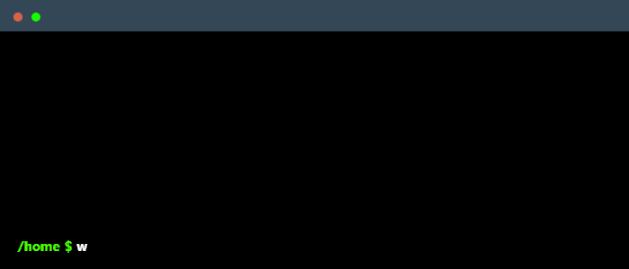

<!--
    Hi there, I'm Christer Dale M. Reyes!
    Happy to see you here exploring my README code
    Feel free to inspire!
-->

<!--
    Terminal GIF or avatar
-->

  

<!--
    Skills badges section
-->

### Main Skills

### Learning / Exploring

### GitHub Stats

<!-- GitHub streak -->

    
     
  

<!--
     Social / Contact links
-->

### Connect with me!

    
    

### Employer?

> [!IMPORTANT]  
> <a href="https://docs.google.com/document/d/19SxyxzF4l14NOsT-3PjP979C22vzjWvyp8EhKULepb0/view?usp=sharing">View my resume</a>

<!--
     Footer / Goodbye
-->

